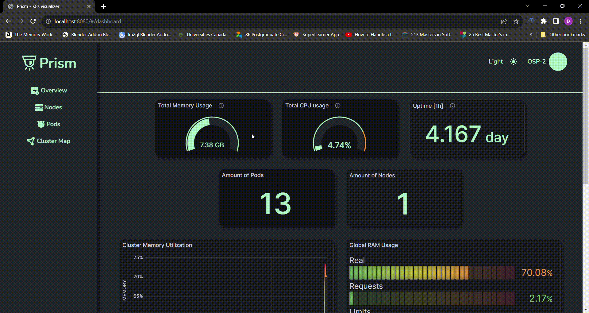
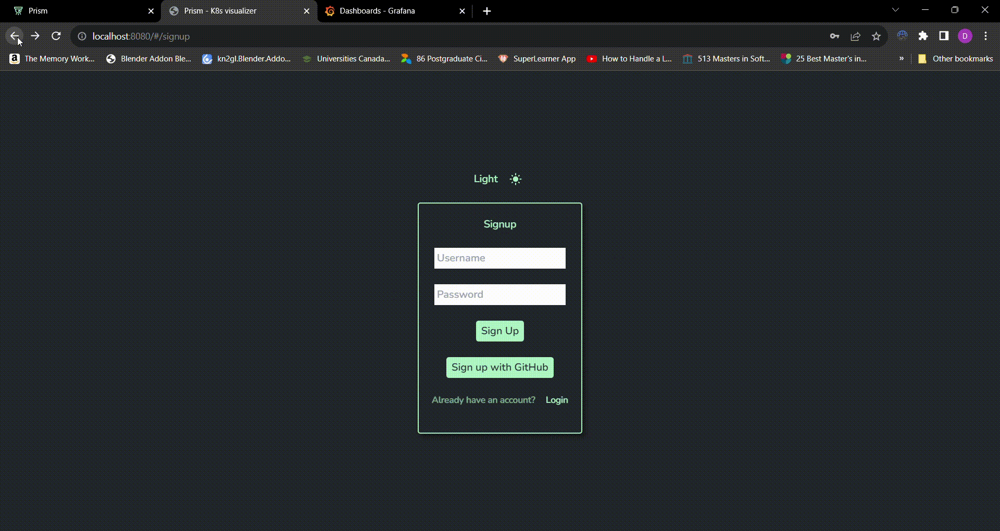

 

# Introducing Prism!

Prism is a Kubernetes and Docker visualizer that helps users understand the status of and relationships between their nodes, pods, services, and containers. It will help developers quickly view their server status and identify problem areas with live metrics and pod health statistics.
Our goal for this project was to provide the best possible user experience while minimizing the code a user has to write (everything launches with a single command).

## Get insights into your Kubernetes clusters and Docker containers

## Secure, and built for you!

Login to Prism to see your clusters, nodes, and pods automatically. And with a dark/light mode, you can enjoy it how you want.

## Features

| Feature                                                           | Status |
| ----------------------------------------------------------------- | ------ |
| Prometheus and Grafana Intergration                               | ✅     |
| Custom Dashboard                                                  | ✅     |
| an Overview, Pods view and Node view of metrics                   | ✅     |
| SASS and Tailwind CSS                                             | ✅     |
| Typescript conversion                                             | ✅     |
| Testing (React Testing Library/Jest front-end, Supertest backend) | ⏳     |
| Fully intergrated OAuth/User authentication                       | ⏳     |
| Customizable Dashboards                                           | 🙏🏻     |
| Historical Data and Trends                                        | 🙏🏻     |

Done = ✅
 
In Progress = ⏳
 
Looking for contributors = 🙏🏻

## Getting Started

### Requirements

- [ ] Running cluster in Kubernetes/ Minikube
- [ ] The following ports must be free:
  - [ ] 8080 ( where the application will be located)
  - [ ] 3333 (used by the backend of the application)
  - [ ] 3000 (used by Grafana)

### Steps :

- [ ] Fork the repository and clone to your local machine
- [ ] Set up authentication: Create a `.env` file in the root directory with the following:
  - [ ] (optional) Private auth database: Your MongoDB URI (key `MONGO_URI`)
  - [ ] (optional) GitHub OAuth: A client ID and secret key (keys `CLIENT_ID`, `CLIENT_SECRET`)
    - [Read more from GitHub about setting up oAuth in your settings](https://docs.github.com/en/apps/oauth-apps/building-oauth-apps/creating-an-oauth-app)
  - [ ] A secret of your choice for json web tokens (key `JWT_SECRET`)
- [ ] Execute the startup shell script (run `./startup.zsh`) - this will:

  - [ ] Install necessary dependencies for the web application
  - [ ] Install Prometheus 🔥 and Grafana 📊 onto your cluster with our custom configuration
  - [ ] Start up the web application

- [ ] Go to `http://localhost:8080` and view metrics to your heart's desire 🤩

### Enjoy Prism!

Once you've done the steps above you'll be able to quickly view live metrics and pod health statistics with ease.

## Contribute to the project

- View our [Contributor README](/DEV_README.md)

## Read More

[Check out our article on Medium!](https://medium.com/@k8s.prism/prism-all-in-one-kubernetes-visualizer-7338b56f8de2)

## Authors

- list of all people and our links
- [Beserat Tafesse](https://github.com/BeseratT)
- [Dawit Merid](https://github.com/dawitmerid)
- [James Li](https://github.com/Jxmes-Li)
- [Josh Hall](https://github.com/joshuarhall)
- [Paul Glenn](https://github.com/paglenn)
